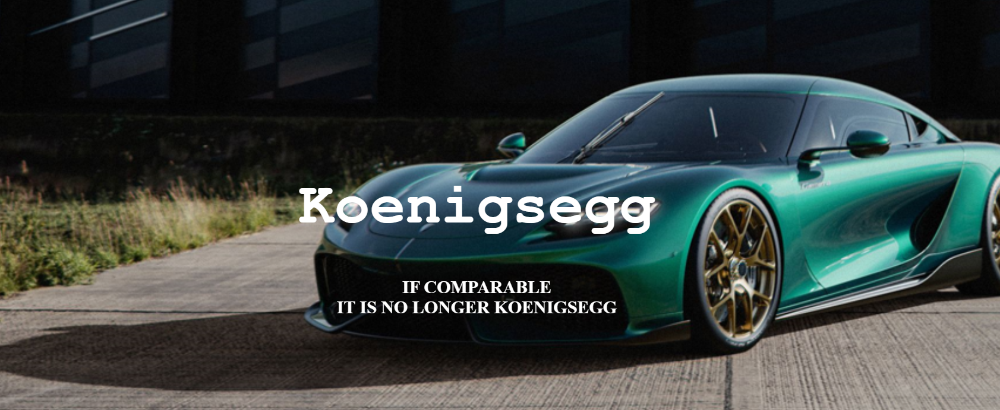
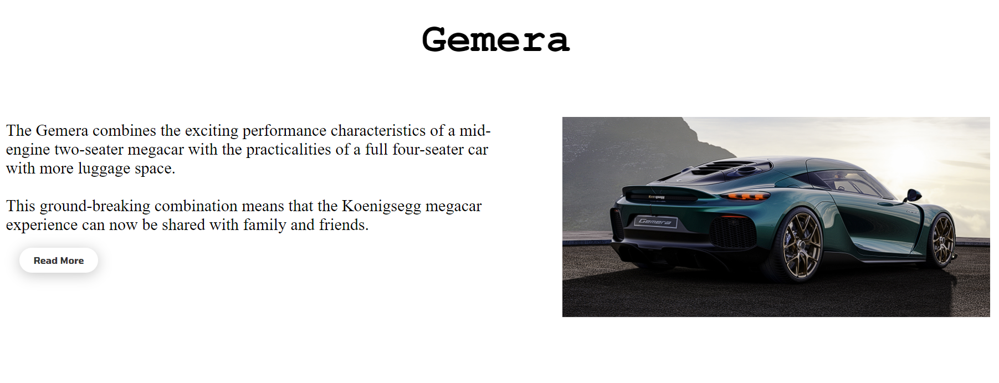
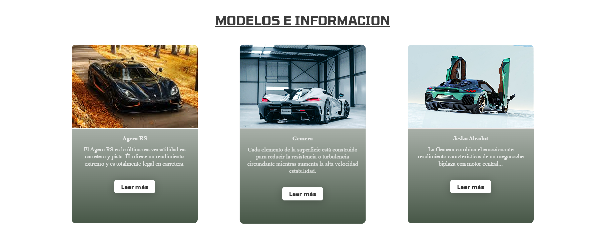
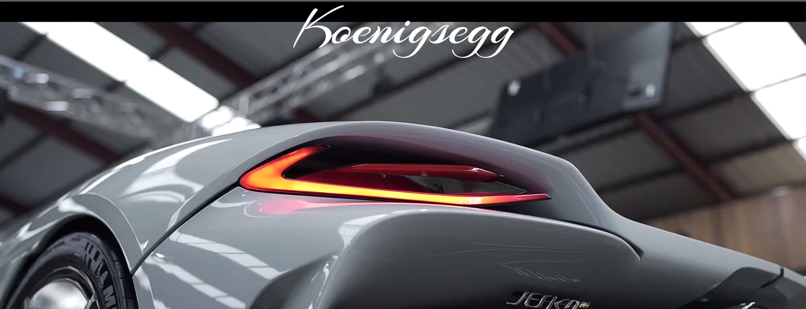

# Memoria del Proyecto - Sitio Web de Koenigsegg

## Índice
1. [Introducción](#1-introducción)
2. [Motivación](#2-motivación)
3. [Estructura del Proyecto](#3-estructura-del-proyecto)
   3.1 [Hero Section](#31-hero-section)
   3.2 [Introducción](#32-introducción)
   3.3 [Carrusel](#33-carrusel)
   3.4 [Cards](#34-cards)
   3.5 [Sección de Video](#35-sección-de-video)
   3.6 [Pie de Página](#36-pie-de-página)
4. [Estilo de la Página](#4-estilo-de-la-página)
   4.1 [Paleta de Colores](#41-paleta-de-colores)
   4.2 [Tipografías](#42-tipografías)
   4.3 [Imágenes](#43-imágenes)
   4.4 [Videos](#44-videos)
   4.5 [Code Snippets](#45-code-snippets)
5. [Trabajo Realizado en Clase](#5-trabajo-realizado-en-clase)
6. [Licencia](#6-licencia)

## 1. Introducción
Este proyecto consiste en la creación de un sitio web dedicado a la marca de automóviles de lujo Koenigsegg. El objetivo es proporcionar a los visitantes una experiencia inmersiva y emocionante al explorar la gama de modelos, características y la historia detrás de esta prestigiosa marca.

## 2. Motivación
La elección de Koenigsegg como tema del proyecto se basa en la fascinación por los automóviles de alto rendimiento y la admiración hacia la innovación y diseño que caracteriza a esta marca. El desafío de crear un sitio web desde cero permitió aplicar y consolidar los conocimientos adquiridos en la asignatura de Lenguajes de Marcas.

## 3. Estructura del Proyecto
### 3.1 Hero Section
La sección inicial presenta una imagen de fondo dinámica que encapsula la esencia de Koenigsegg. Un llamado a la acción invita a los visitantes a explorar más sobre la marca. La imagen de fondo es adaptable a diferentes dispositivos para garantizar una experiencia visualmente atractiva.

  

### 3.2 Introducción
Esta sección presenta el modelo Gemera, destacando sus características únicas mediante un diseño de cuadrícula de dos columnas que combina imágenes y texto descriptivo.

  

### 3.3 Carrusel de Modelos
Un carrusel de imágenes ofrece una vista detallada de varios modelos de automóviles Koenigsegg. Cada imagen se presenta con un texto descriptivo para resaltar las características clave de cada modelo.

  

### 3.4 Tarjetas Informativas
Tarjetas interactivas proporcionan detalles específicos sobre modelos destacados como el Agera RS, el Gemera y el Jesko Absolut. Los botones "Leer más" revelan información adicional para una experiencia de usuario más completa.

  

### 3.5 Sección de Video
Una sección dinámica presenta un video de fondo que ilustra la emoción y la potencia de los automóviles Koenigsegg. El texto superpuesto ofrece una marca distintiva y un llamado a la acción.

  

### 3.6 Pie de Página
El pie de página contiene enlaces a redes sociales y proporciona una navegación rápida hacia las diversas secciones del sitio. La información de derechos de autor se presenta de manera prominente.

  

## 4. Estilo de la Página
### 4.1 Paleta de Colores
La paleta de colores ha sido seleccionada para reflejar la elegancia y modernidad asociadas con Koenigsegg. Tonos oscuros se combinan con acentos vibrantes para crear un contraste visualmente atractivo.

### 4.2 Tipografías
Se han utilizado fuentes personalizadas para dar un toque distintivo al contenido textual. La legibilidad y la coherencia son clave en la elección tipográfica.

### 4.3 Imágenes
Las imágenes utilizadas se han seleccionado cuidadosamente para destacar la belleza y la potencia de los automóviles Koenigsegg. Se ha dado especial atención a la calidad y composición visual.

### 4.4 Videos
El video de fondo en la sección de video ha sido elegido para transmitir la emoción y la velocidad asociadas con los automóviles de la marca. La reproducción automática, el bucle y la reproducción silenciosa se utilizan para mejorar la experiencia del usuario.

### 4.5 Code Snippets
Se han incorporado varios fragmentos de código, como la barra de navegación fija, el carrusel de imágenes y las tarjetas interactivas. Estos se han adaptado y personalizado para cumplir con los requisitos específicos del proyecto.

## 5. Trabajo Realizado en Clase
El proyecto fue desarrollado como parte de las clases de Lenguajes de Marcas. Se abordaron conceptos clave, como la estructura HTML, estilos CSS, diseño responsivo y técnicas avanzadas para mejorar la presentación visual.

## 6. Licencia
Este proyecto está bajo la Licencia CC-BY. Puedes usar, modificar y distribuir este trabajo siempre que des créditos al autor original.

**Autor: Rafael Moncayo Pérez**
**Diciembre de 2023**
